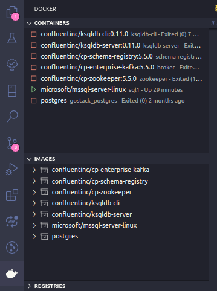
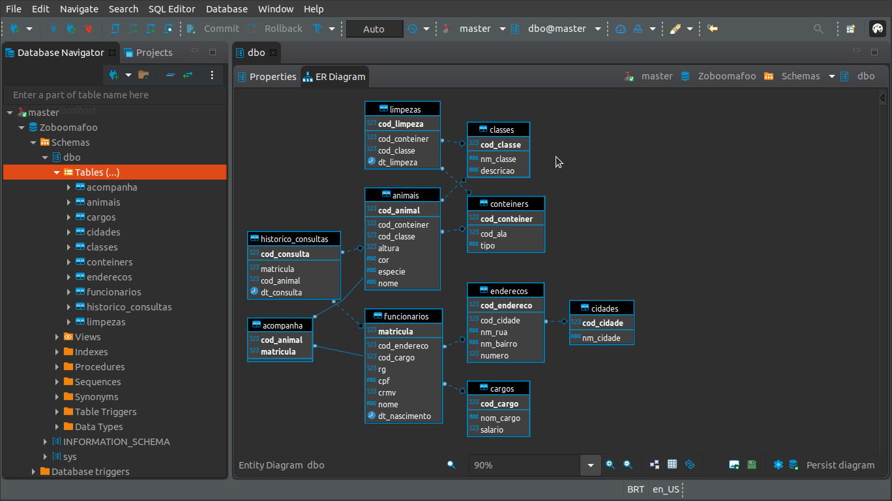
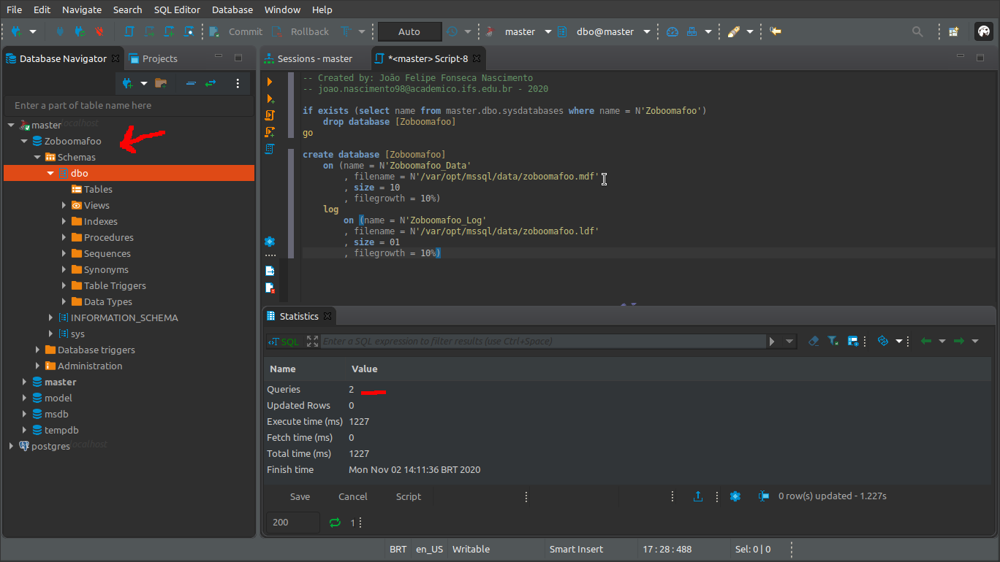
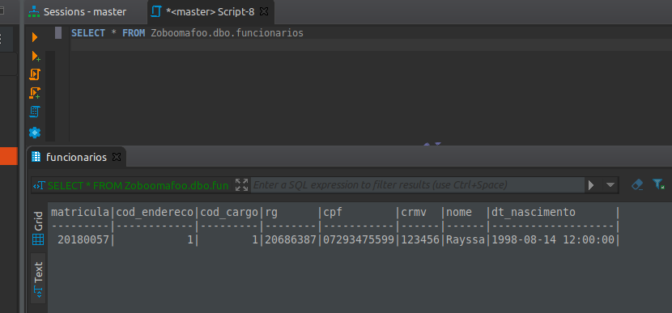
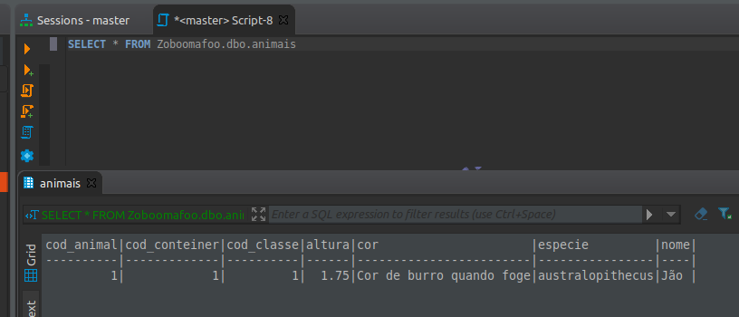
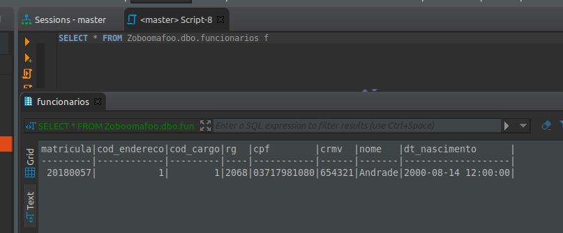

# Administração de Banco de Dados

## Resolução atividades do dia 27/10/2020, Procedures - Functions com SQL SERVER

## **Contents**:

- [Tools I used on my ubuntu linux](#Tools-I-used-on-my-ubuntu-linux)
- [How to execute](#How-to-execute)
    
## Tools I used on my ubuntu linux

### **I'm using**:  

*SQL Server for linux with docker*;

 

 

*Docker extension for VScode*; 

 

 

*VScode to write SQL Scripts* :p

 

 

*DBeaver SQL client software.*

 

# How to execute

## [ 01 ] : **Create a database using the available ERD**

    Create a new database using `create-database-zoboomafoo.sql` DDL script

 

## [ 02 ] : **Create all the necessary tables**

    Create tables using `create-tables-zoboomafoo.sql` DML script

 

## [ 03 ] : **Create all procedures to insert data**

    Create insert procures using `create-insert-procedures.sql` script

 

## [ 04 ] : **Create all procedures to update data**

    Create update procures using `create-update-procedures.sql` script

 

## [ 05 ] : **Execute procedures to insert data**

    Execute procedures to insert inital data `execute-insert-procedures.sql` script

 

 

 

## [ 06 ] : **Execute procedures to update data**

    Execute procedures to update data `execute-update-procedures.sql` script

 

 

## [ 07 ] : **Create scalar functions**

    Create scalar functions `create-scalar-functions.sql` script

 

## [ 08 ] : **Create table functions**

    Create table functions `create-table-functions.sql` script

 

